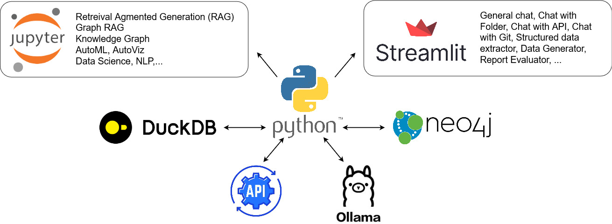
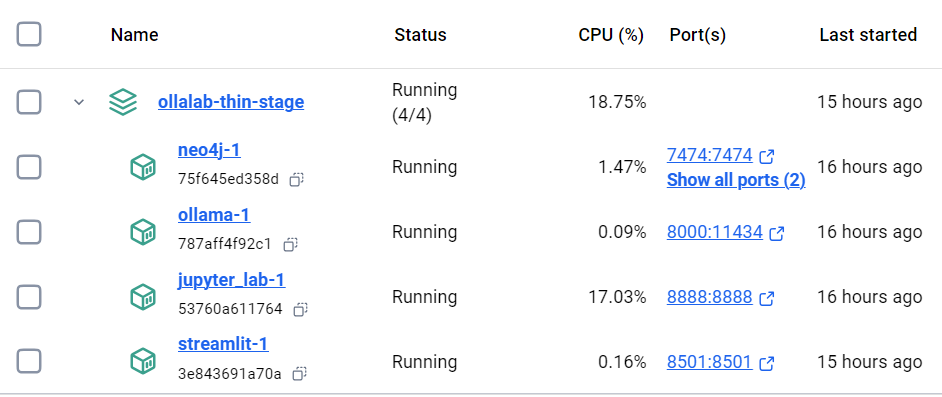

<br />

# OllaLab-Lean

<h4>Accelerating Local LLM-based Research and Development</h4>

[]()
[]()
[]()


OllaLab-Lean is a lean Docker stack designed to help both novice and experienced developers rapidly set up and begin working on LLM-based projects. This is achievable via simplified environment configuration and a cohesive set of tools for Research and Development (R&D). The project includes several key components.
- Pre-made prompt templates and applications to accelerate research and developments.
- Ollama for managing local openweight Large Language Models (LLMs).
- LangChain for orchestrating LLM pipelines, allowing users to seamlessly connect, manage, and optimize their workflows.
- Streamlit server to locally host dynamic LLM-based web applications.
- Jupyter Lab server as the integrated development environment (IDE), providing users with an interactive space to write, test, and iterate code efficiently.
- Neo4J vector database supporting retrieval-augmented generation (RAG) tasks.
- Data analysis, AI, ML tools such as: DuckDB, AutoGluon, AutoViz, GenSim, etc.
- Monitoring and Logging tools such as: Elastic Search, Kibana, Grafana, Prometheus.

 &nbsp;




## Latest News
* [2024/09/23] 🚀 Project Initialized

## Table of Contents
- [Usage](#usage)
- [Installation](#installation)
- [Planned Items](#planned-items)
- [File Structure](#file_structure)
- [Contributing](#contributing)
- [License](#license)
- [Code of Conduct](#code-of-conduct)

## Usage
OllaLab-Lean supports most LLM and Data Science R&D activities. A few sample use cases are:
- Use pre-made prompt templates and the provided Simple Chat Streamlit application to generate initial codes for R&D projects in any language.
- Use the provided "Chat with Local Folder" to interact with multiple documents stored in a local folder for research and learning purposes.
- Use Jupyter Lab and the provided Jupyter Notebooks to learn and experiment with cutting edge topics such as Graph-based Retreival Augmented Generation (RAG), other advanced RAG techniques, knowledge graph algorithms, and so on.
- Use Jupyter Lab and the installed AutoML, AutoViz packages to efficiently execute Data Science/AI/ML tasks.

## Installation
You should be familiar with the command line interface, have Docker,Git, and other supporting CLI tools installed. If you are planning to use nVidia GPUs, you should have installed all nVidia supporting software. We will provide a detailed pre-installation instruction focusing on nVidia supporting stack at a later time. For now, please check out [Installing Docker Desktop on Windows](https://docs.docker.com/desktop/install/windows-install/) or [Installing Docker Desktop on MAC](https://docs.docker.com/desktop/install/mac-install/) if you don't have it installed. The below installation steps passed the test for AMD64 architecture, 12GB nVidia GPU, and Docker Compose for Widows on WSL2.

1. Test if Docker and Docker Compose are running
```
docker --version
docker info
docker-compose --version
```
2. Clean up Docker (optional but recommended)
```
docker system prune -f
docker rmi -f $(docker images -a -q)
```
3. Clone this repository to your selected current working folder
```
git clone https://github.com/GSA/FedRAMP-OllaLab-Lean.git
```
4. Rename the "env.sample" file to ".env". Change the default password/token/secret/salt values in the ***.env*** file
5. Build the Docker Compose project
with cache
```
docker-compose build
```
or without cache (recommended)
```
docker-compose build --no-cache
```
6. Run the Docker Compose project
with Default Services only (recommended for the lean-est stack)
```
docker-compose up
```
with Default Services and Monitoring Services
```
docker-compose --profile monitoring up
```
with Default Services and Logging Services
```
docker-compose --profile logging up
```
with Default Services, Monitoring Services, and Logging Services
```
docker-compose --profile monitoring --profile logging up
```
7. Verify the set up
Your running stack should look similar to this


8. Download llama3.1:8b
If you are using Docker Desktop, you can click on the Ollama instance and get to the "Exec" tab to get to the instance CLI. In the CLI, run:
```
ollama pull llama3.1:8b
```
After it is done, run the following command and verify if **llama3.1:8b** was successfully pulled.
```
ollama list
```
You may pull other models and interact with them via the CLI. However, **llama3.1:8b** must be pulled for the provided Streamlit apps to work. In the next release, we will allow the Streamlit apps to ask you for which LLMs you want to work with.

## Planned Items
- Add more prompt templates for R&D
- Adjust the Jupyter Notebooks to be compatible with OllaLab-Lean stack
- Add LLM-based JSON extractor app
- Add "Chat with Git Repo" app
- Add "Chat with API" app
- Add tutorials for R&D use cases with OllaLab-Lean

## File Structure
```
OllaLab_Lean/
├── docker-compose.yml          # Main Docker Compose file
├── env.sample                  # Sample .env file, need to be changed to .env with proper values
├── images/                     # Relevant charts and images
├── jupyter_lab/
│   ├── Dockerfile
│   ├── notebooks/
│   │   └── *.ipynb             # Curated notebooks for LLM R&D
│   └── requirements.txt                
├── prompt-templates/           # Prompt templates for LLM-driven R&D
├── streamlit_app/
│   ├── Dockerfile
│   ├── app/
│   │   ├── main.py             # Streamlit app home
│   │   └── pages/      
│   │       ├── folder_chat/    # Storing folders created by Folder Chat app
│   │       ├── Folder_Chat.py  # App to chat with a folder's content
│   │       ├── API_Chat.py     # App to chat with requested API data (underdevelopment)
│   │       ├── Simple_Chat.py  # App to chat
│   │       └── Git_Chat.py      # Chat with a git repository    
│   └── requirements.txt
├── ollama/                     # LLM management and inference API
│   ├── Dockerfile
│   └── scripts/
│       └── entrypoint.sh       # Script to load LLM model
├── monitoring/
│   ├── prometheus/
│   │   └── prometheus.yml
│   └── grafana/
│       └── provisioning/
│           ├── dashboards/
│           └── datasources/
├── logging/
│   ├── elasticsearch/
│   ├── logstash/
│   │   └── logstash.conf
│   └── kibana/
├── tests/
│   └── test_services.py
├── scripts/
│   └── firewall_rules.sh       # Host-level firewall configurations
└── .gitignore

```

## Contributing

We welcome contributions to OllaLab-Lean especially on the [Planned Items](#planned-items)! 

Please see our [Contributing Guide](CONTRIBUTING.md) for more information on how to get started.

## License

[CC0 1.0 Universal](LICENSE)

## Code of Conduct

Please note that this project is released with a [Contributor Code of Conduct](CODE_OF_CONDUCT.md). By participating in this project and/or cloning the project, you agree to abide by its terms.